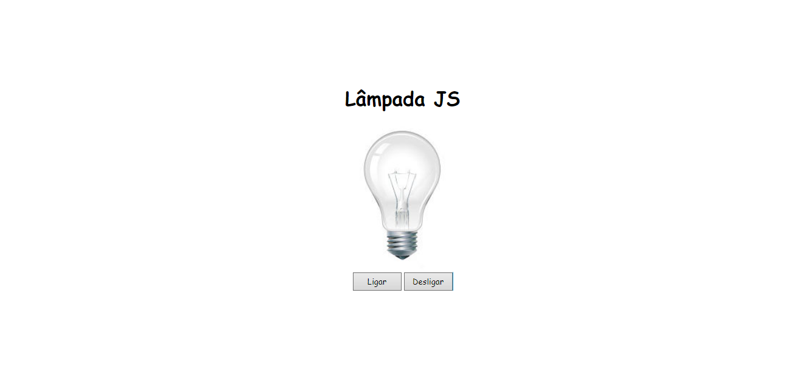
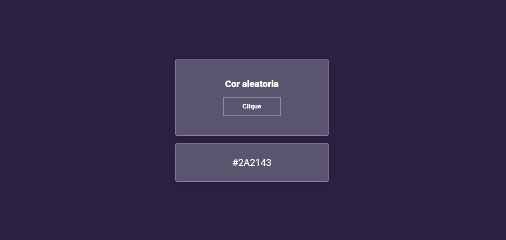
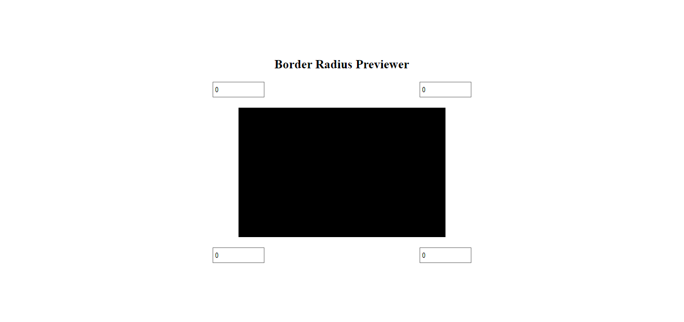
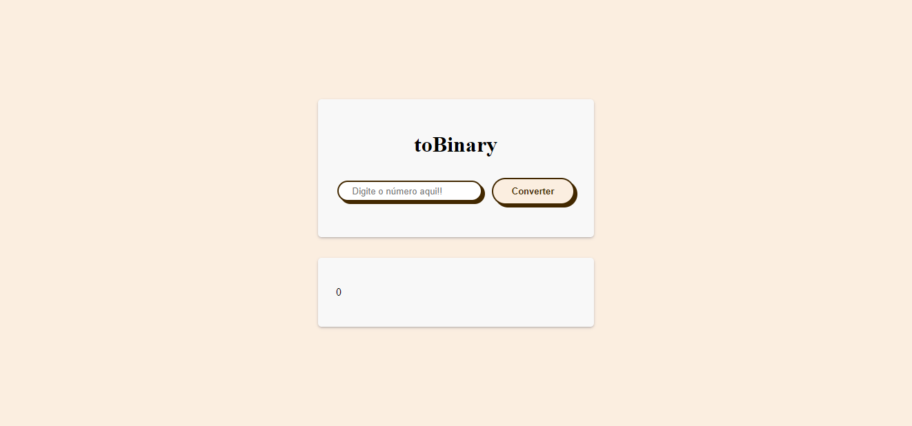
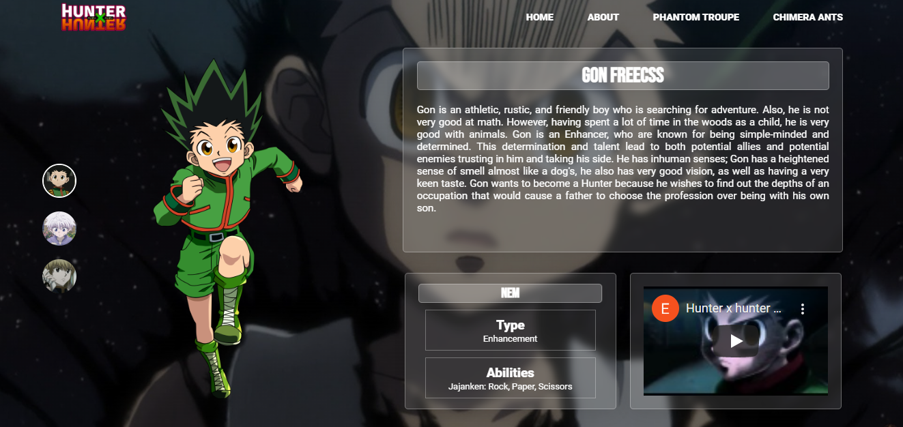
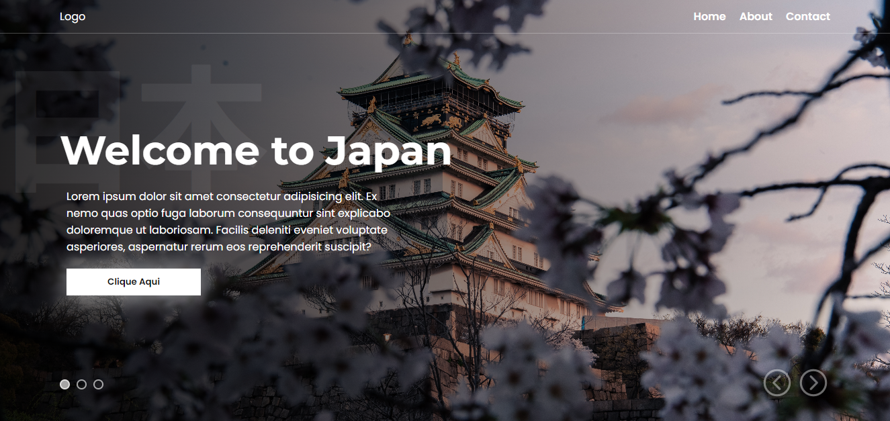

<h1 align="center">Projetos JavaScript</h1>

 
 

**Alguns de meus projetos feitos em JavaScript durante meu aprendizado sobre a linguagem, cada projeto tem sua explicação detalhada de como fazer dentro de suas respectivas pastas**

- [Perfil](https://github.com/EriickW)
- [Outros contatos](https://eriickw.github.io/linktree-main/)

 

## Projetos:

<h3>1 - Lampada JS</h3>

Acendendo lampada com eventos em JavaScript
- [Pasta](./Lampada_JS/)

 

<h3>2 - Cor Aleatoria</h3>

Gerando cores aleatorias ao clicar no botão mudando o fundo e colocando o Hexadecimal da com em um espaço abaixo
- [Pasta](./corAleatoria/)

 

<h3>3 - Border Radius Previewer</h3>

Projeto que pode colocar valores em px para ver como vai ficar o border radius no elemento
- [Pasta](./border-radius-previewer/)

 

<h3>4 - toBinary</h3>

Conversor de números inteiros para binário
- [Pasta](./toBinary/)

 

<h3>5 - Hunter X Hunter</h3>

Projeto de uma página sobre o anime Hunter X Hunter,
que há uma troca de personagens atravez das fotos, a troca acontece atravez de objetos JS com todos os atributos na página sobre o personagem
- [Pasta](./hunter-x-hunter/)

 

<h3>6 - Japão</h3>

Página que mostra informações de regiões do Japão 
com um slider de imagems usandos os botoes de navegação na parte inferior direita
- [Pasta](./Jap%C3%A3o/)

